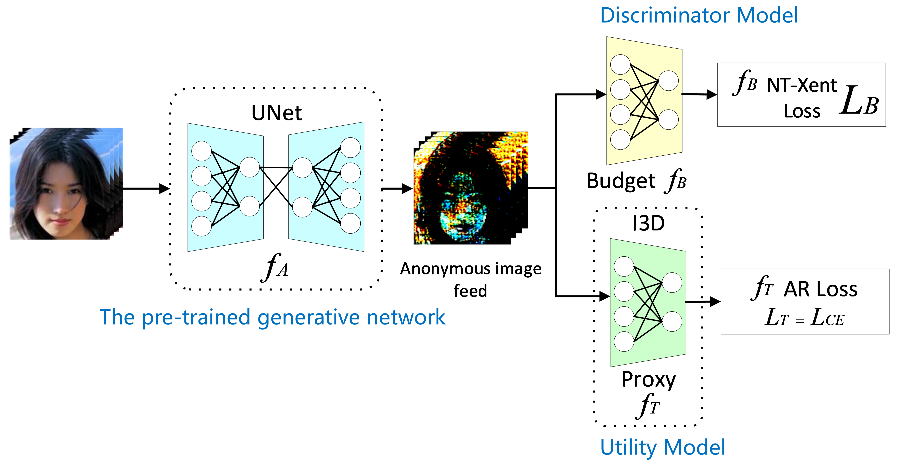
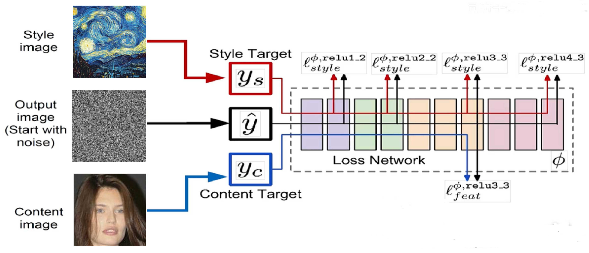
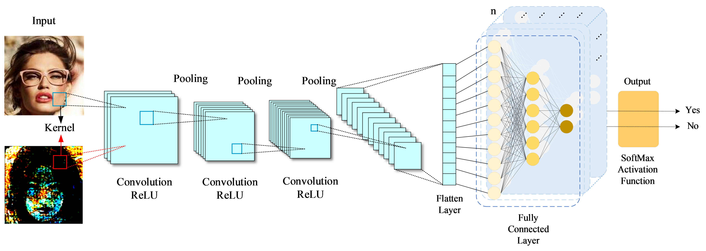
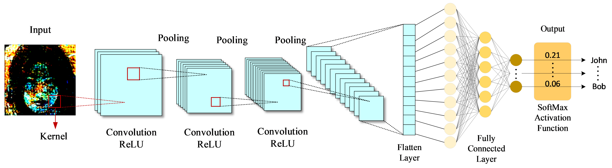
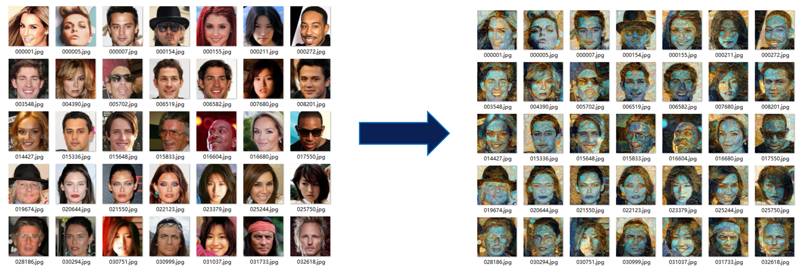

# Face Identity Privacy Protection via Style Transfer


<p align="center">
  <a href="https://www.python.org/downloads/"></a>
  <a href="https://pytorch.org/"></a>
  <a href="LICENSE"></a>
</p>


Privacy-preserving face recognition that applies neural style transfer to anonymize facial images, ensuring that **machines can still recognize the identity while humans cannot**.

> This project reproduces the core ideas from the paper *"Privacy-Preserving Face Recognition via Style Transfer GANs"* as a course design project.

## Overview

Modern face recognition pipelines send user images to cloud servers for computation, exposing sensitive biometric data to risks of interception, leakage, and misuse. This project addresses the problem by inserting a **style-transfer-based anonymization layer** before data leaves the local device.

The generated images are visually distinct from the originals — a human observer cannot tell who the person is — yet a downstream face recognition model trained on the anonymized outputs maintains high identification accuracy.

<p align="center">
  
</p>

### Key Idea

Given an original face image $x$, a pre-trained generator $G$ produces an anonymized version $\hat{x} = G(x)$, which satisfies two competing objectives:

| Objective | Metric |
|---|---|
| **Utility** — the anonymized image remains recognizable | Recognition accuracy on $\hat{x}$ |
| **Privacy** — human-visible attributes are obscured | Drop in attribute classification accuracy between $x$ and $\hat{x}$ |

Five binary privacy attributes from CelebA are used as the protection targets: **Male**, **Wavy Hair**, **Oval Face**, **Pointy Nose**, and **Bags Under Eyes**.

## Method

### Framework

The system consists of three neural networks trained adversarially:

<p align="center">
  
</p>
<p align="center">
  
</p>
<p align="center">
  
</p>

1. **Generator** — An encoder-decoder style transfer network that takes the original face and outputs an anonymized version. Pre-trained with a VGG-19 perceptual loss to learn the target artistic style before adversarial fine-tuning.

2. **Discriminator** — A ResNet-18 backbone with 5 independent linear heads (one per privacy attribute). Trained to detect whether each privacy attribute is still recognizable in the anonymized output. The generator is rewarded when the discriminator *fails* to identify the original attributes.

3. **Recognizer** — A ResNet-18 classifier that performs 12-way identity recognition on the anonymized images. The generator is penalized when recognition accuracy drops, preserving utility.

### Style Transfer Preprocessing

Before adversarial training, all original face images undergo neural style transfer using a VGG-19 feature extractor. Content features (layer `conv3`) and style features (layers `conv1`–`conv5`) from a reference style image are fused via Gram-matrix optimization to produce the initial stylized dataset.

<p align="center">
  
</p>

### Optimization Strategies

Three training strategies were explored to balance the privacy–utility trade-off:

| Strategy | Description | Stability |
|:---:|:---:|:---:|
| **Normal** | Train on all 5 privacy attributes simultaneously each batch | Most stable |
| **Entropy** | Focus on the single worst-protected attribute per batch | Prone to overfitting |
| **K-Beam** | Select the worst attribute, train 5 rounds per batch on it | Moderate |

The **Normal** strategy achieved the best and most consistent results.

## Results

Evaluation on the CelebA test set (12 identities, 5 privacy attributes):

<div align="center">

| Metric | Value |
|:---:|:---:|
| Face Recognition Accuracy | **96.73%** |
| Privacy Protection Rate | **14.25%** |
| Optimization Strategy | Normal |
| Training Epoch (best run) | Run #45 |

</div>

The privacy protection rate is defined as the drop in attribute classification accuracy before vs. after anonymization (higher = better privacy).


## Project Structure

```
face_identity/
├── transferGAN.py            # Main adversarial training loop (Generator + Discriminator + Recognizer)
├── test.py                   # Evaluation script — load trained models & report metrics
├── slowtransfer.py           # Single-image style transfer (VGG-19, Gram-matrix optimization)
├── generator.py              # Standalone generator pre-training script
├── discriminate.py           # Standalone discriminator training script
├── recognization.py          # Standalone recognizer training script
├── dic_product.py            # Build attribute-label dictionary from CelebA annotations
├── environment-test.py       # Quick PyTorch/CUDA environment check
├── style_img.jpg             # Reference style image for neural style transfer
├── model_generator.pth       # Trained generator weights (to be provided)
├── model_discriminate.pth    # Trained discriminator weights (to be provided)
├── model_recognization.pth   # Trained recognizer weights (to be provided)
├── data/
│   ├── data-split.py         # Train/test split utility
│   ├── img_change.py         # Image file matching & copying utility
│   ├── orient/               # Original face images
│   ├── transfer/             # Style-transferred images
│   └── label/                # Identity & attribute label files
├── data_process/
│   ├── celeba/               # CelebA dataset preprocessing scripts
│   │   ├── picture-crop.py   # Center-crop images to 144×144
│   │   ├── picture-load.py   # Filter & copy images by identity label
│   │   └── picture-num.py    # Generate per-identity label files from CelebA annotations
│   ├── project/
│   │   ├── slowtransfer.py   # Single-image iterative style transfer
│   │   └── multi-transfer.py # Batch-optimized multi-image style transfer
│   ├── face_dict/
│   │   └── dic_product.py    # Attribute dictionary generator (data processing pipeline)
│   └── sample.py             # Multi-process CelebA data sampler & splitter
└── list_attr_celeba.txt      # CelebA attribute annotations (required, not included)
```

## Getting Started

### Prerequisites

- Python 3.8+
- PyTorch 2.0+ (CUDA recommended)
- torchvision
- PIL (Pillow)
- NumPy
- OpenCV (cv2)
- matplotlib

Install dependencies:

```bash
pip install torch torchvision pillow numpy opencv-python matplotlib
```

### Dataset Preparation

1. Download the [CelebA dataset](https://mmlab.ie.cuhk.edu.hk/projects/CelebA.html) and place `list_attr_celeba.txt` and `identity_CelebA.txt` in the project root.

2. Select your target identities and run the data preparation pipeline:

```bash
# Step 1: Sample identities and create label files (modify TARGET_CATEGORY_IDS in script first)
python data_process/sample.py

# Step 2: Crop images to 144×144
python data_process/celeba/picture-crop.py

# Step 3: Run style transfer on all content images
python data_process/project/multi-transfer.py

# Step 4: Split into train/test sets
python data/data-split.py
```

### Verify Environment

```bash
python environment-test.py
```

Should print your PyTorch version and `True` if CUDA is available.

### Training

The training pipeline involves three stages:

**Stage 1 — Generator Pre-training** (learn the target style):

```bash
python generator.py
```

**Stage 2 — Adversarial Joint Training** (end-to-end optimization):

```bash
# Adjust n_epochs at line 370 of transferGAN.py, then:
python transferGAN.py
```

This trains the generator, discriminator, and recognizer jointly. Model checkpoints are saved automatically as `model_generator.pth`, `model_discriminate.pth`, and `model_recognization.pth`.

**Stage 3 — Individual Component Training** (optional, for fine-tuning):

```bash
python discriminate.py   # Fine-tune discriminator only
python recognization.py  # Fine-tune recognizer only
```

### Evaluation

```bash
python test.py
```

Output metrics:
- **Accuracy on Recognition test set** — face identification accuracy (target: > 60%, ideally approaching 100%)
- **Accuracy on Before Discriminate test set** — attribute classification on original images (baseline)
- **Accuracy on After Discriminate test set** — attribute classification on anonymized images (lower = better privacy)

The privacy protection rate is `Before − After`. A rate above 15% with recognition accuracy above 60% indicates a well-functioning model.

### Training Tips

- Start with `n_epochs = 100` and gradually reduce as performance converges.
- Save model checkpoints (`model_*.pth`) and test result screenshots when you hit good results.
- If `After > Before`, the model has collapsed — revert to a previously saved checkpoint and resume with a smaller epoch count.
- Each training run is stochastic; results vary across runs. Multiple restarts are expected.

## License

This project is released under the [MIT License](LICENSE).

## Acknowledgments

- [CelebA Dataset](https://mmlab.ie.cuhk.edu.hk/projects/CelebA.html) by MMLab, CUHK
- GAN training framework built with [PyTorch](https://pytorch.org/)
